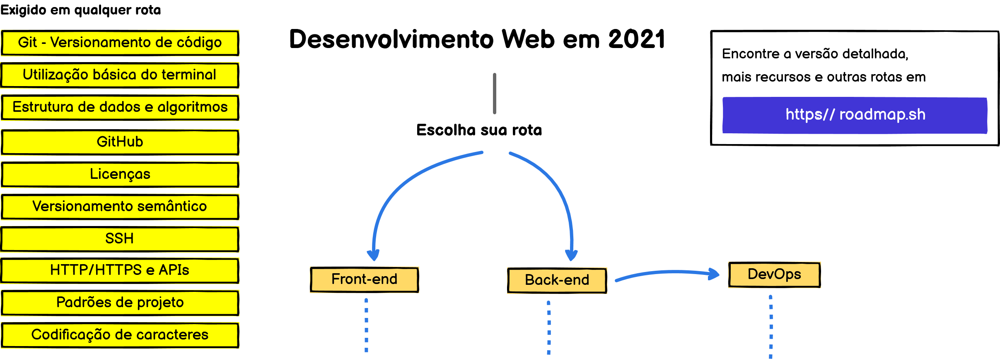
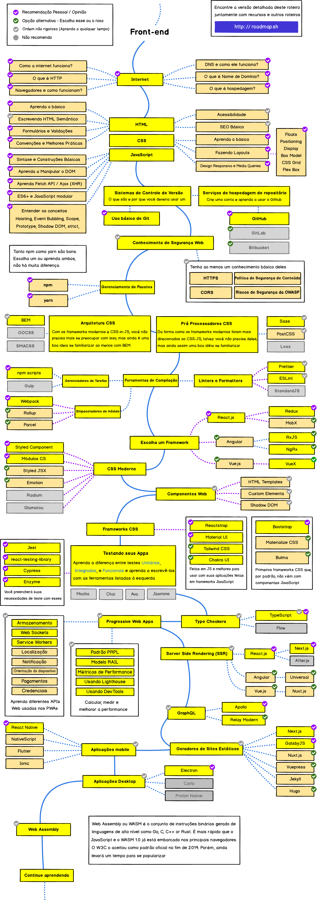
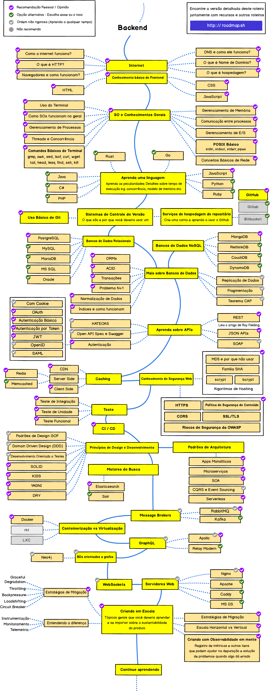
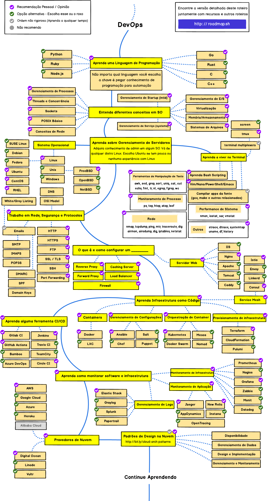

# Trilhas para se tornar um desenvolvedor web em 2021

> A seguir encontra-se um conjunto de gráficos demonstrando as rotas/trilhas e as tecnologias que você pode aprender para se tornar um(a) desenvolvedor(a) frontend, backend ou um(a) ver o que é necessário na cultura DevOps.

> O autor original ([kamranahmeds](https://github.com/kamranahmedse)) fez esses gráficos a pedido de um professor, com o intuito de ajudar os alunos a terem uma perspectiva da área.

> Esse é um fork do repositório, adaptado e resumido para pt_br para ser usado na disciplina de Programação WEB da UFERSA Angicos.

***

# Propósito

> O propósito dessas trilhas é dar uma organizada na confusão. Para os iniciantes, tenha calma. Você não precisa aprender tudo!

***

## Início - escolha sua trilha/rota.

[Em inglês.](./img_en_us/intro-map.png)

## Trilha front-end 

[Em inglês.](./img_en_us/frontend-map.png)

## Trilha back-end

[Em inglês.](./img_en_us/backend-map.png)

## Trilha DevOps

[Em inglês.](/img_en_us/devops-map.png)

